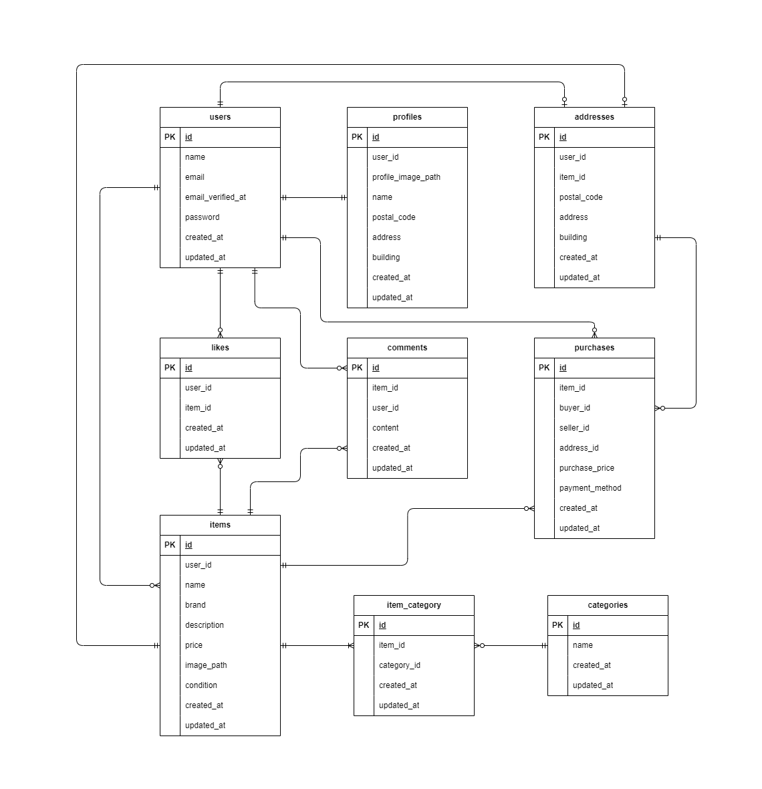

# coachtechフリマ

## 環境構築
**Dockerビルド**
1. `git clone git@github.com:atyamaru1211/mogi-1.git`
2. DockerDesktopアプリを立ち上げる
3. `docker-compose up -d --build`


**Laravel環境構築**
1. `docker-compose exec php bash`
2. `composer install`
3. 「.env.example」ファイルを 「.env」ファイルに命名を変更。または、新しく.envファイルを作成 `cp .env.example .env`
4. .envに以下の環境変数を追加
``` text
DB_CONNECTION=mysql
DB_HOST=mysql
DB_PORT=3306
DB_DATABASE=laravel_db
DB_USERNAME=laravel_user
DB_PASSWORD=laravel_pass
```
5. .envに、以下のメール設定を追加
```
MAIL_MAILER=smtp
MAIL_HOST=mailhog
MAIL_PORT=1025
MAIL_USERNAME=null
MAIL_PASSWORD=null
MAIL_ENCRYPTION=null
MAIL_FROM_ADDRESS="test@example.com"
MAIL_FROM_NAME="${APP_NAME}"
```
6. .envに、StripeのAPIキー設定を追加。pk_test_YOUR_STRIPE_PUBLISHABLE_KEYとsk_test_YOUR_STRIPE_SECRET_KEYに関しては[Stripe ダッシュボード](https://dashboard.stripe.com/developers/api_keys) から取得してください。
```
STRIPE_PUBLIC_KEY=pk_test_YOUR_STRIPE_PUBLISHABLE_KEY
STRIPE_SECRET_KEY=sk_test_YOUR_STRIPE_SECRET_KEY
```

7. アプリケーションキーの作成
``` bash
php artisan key:generate
```

8. マイグレーションの実行
``` bash
php artisan migrate
```

9. シーディングの実行
``` bash
php artisan db:seed
```

**テスト環境構築**　``
1. `docker-compose exec mysql bash`
2. `mysql -u root -p`　パスワードを要求されたら`root`
2. `CREATE DATABASE demo_test;`
3. mysqlコンテナを`exit`で出て、PHPコンテナに入り直す。`docker-compose exec php bash`
4. .envをコピーして.env.testingというファイルを作成。`cp .env .env.testing`
5. .env.testingに以下の環境変数を追加
``` text
APP_NAME=Laravel
APP_ENV=test
APP_KEY=
APP_DEBUG=true
APP_URL=http://localhost

DB_CONNECTION=mysql
DB_HOST=mysql
DB_PORT=3306
DB_DATABASE=demo_test
DB_USERNAME=root
DB_PASSWORD=root

6. テスト用アプリケーションキーの作成
``` bash
php artisan key:generate --env=testing

7. マイグレーションの実行
``` bash
php artisan migrate --env=testing
```

8. シーディングの実行
``` bash
php artisan db:seed --env=testing


## 使用技術(実行環境)
- PHP 7.4.9
- Laravel8.83.29
- MySQL8.0.26

## ER図


## URL
- 開発環境：http://localhost/
- phpMyAdmin:：http://localhost:8080/
